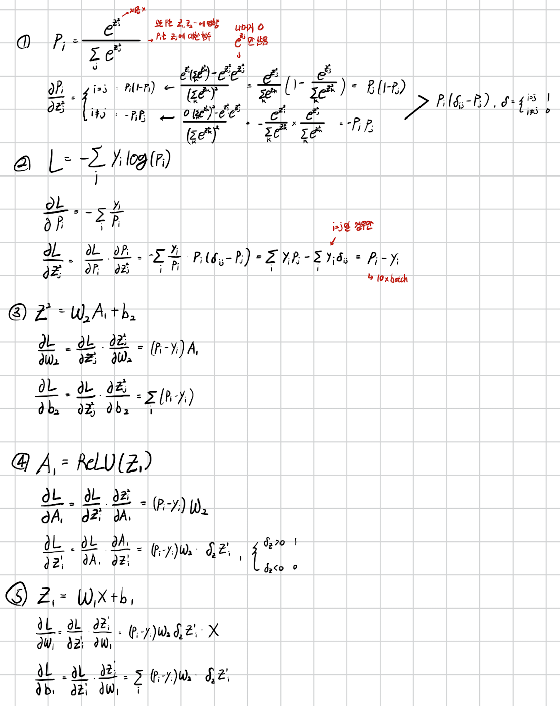
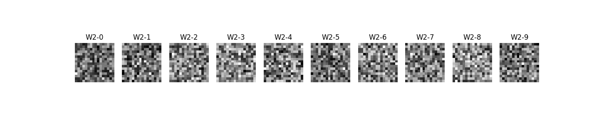

# MLP from scratch
w/o torch

### run
``` bash
uv run main.py
```

### mnist dataset
``` bash
data_path:  /Users/<Username>/.cache/kagglehub/datasets/oddrationale/mnist-in-csv/versions/2
<class 'pandas.core.frame.DataFrame'>
RangeIndex: 60000 entries, 0 to 59999
Columns: 785 entries, label to 28x28
dtypes: int64(785)
memory usage: 359.3 MB
```

### architecture


### gradient


### result
``` bash
Iter:  0
Acc :  0.13085
Iter:  50
Acc :  0.7181666666666666
Iter:  100
Acc :  0.77745
...
Iter:  950
Acc :  0.9056
```
